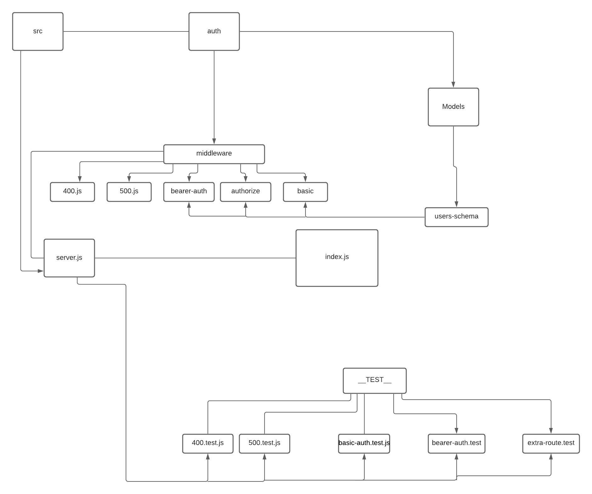

# auth-server

### router

- router.post('/signup', postuser);
- router.post('/signin', basicAuth, postuserAuth);
- router.get('/users', getuser);

### extra-routes

- router.get('/secret', bearerMiddleware, (req,res));

- router.get("/read", bearerMiddleware, accesroute("read"),(req,res))

- router.post("/create", bearerMiddleware, accesroute("create"),(req,res));

- router.put("/update", bearerMiddleware, accesroute("update"),(req,res));

- router.delete("/delete", bearerMiddleware, accesroute("delete"),(req,res)

## here we have UML

